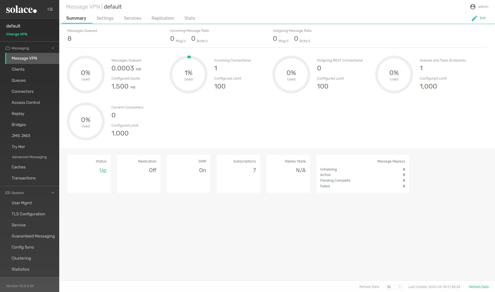
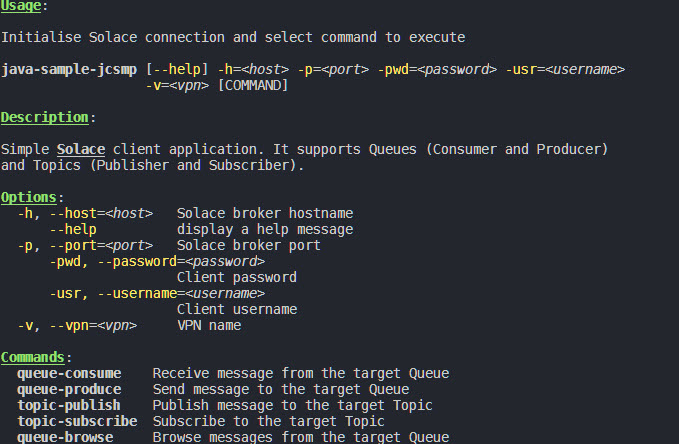

# Solace Examples #

This repository contains example docker-compose for Solace Standard Edition and an example Java code samples.

### Docker ###

In order to run Solace Docker container, execute command:
```bash
docker-compose up -d
```
In order to access Solace Administration GUI, open:
```
http://localhost:8080
```
and login using _admin/admin_ credentials.



### Example Java CLI for SMF ###
Sample application is using SMF (Solace Message Format) to communicate with Solace.
In order to build the CLI application run below Maven command in the _samples/java-sample-jcsmp_ directory:
```
mvn clean install
```
Use below wrapper scripts to use it for different scenarios:
* [connection_check.sh](samples/java-sample-jcsmp/connection_check.sh)
* [queue_browse.sh](samples/java-sample-jcsmp/queue_browse.sh)
* [queue_receive.sh](samples/java-sample-jcsmp/queue_receive.sh)
* [queue_send.sh](samples/java-sample-jcsmp/queue_send.sh)
* [topic_publish.sh](samples/java-sample-jcsmp/topic_publish.sh)
* [topic_subscribe.sh](samples/java-sample-jcsmp/topic_subscribe.sh)

If you want to use the cli directly, you can use the _help_ command:
```
java -jar ./target/java-sample-jcsmp-1.0-SNAPSHOT-jar-with-dependencies.jar --help
```


### TODO ###
- [ ] Add more complicated scenarios
- [ ] Add JMS examples